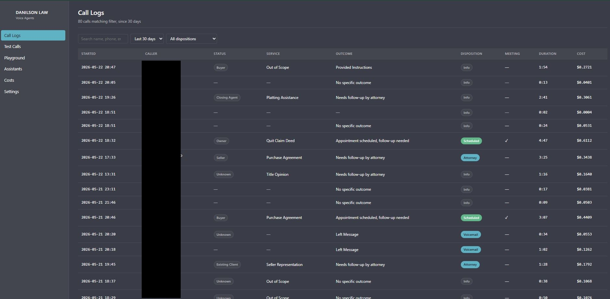
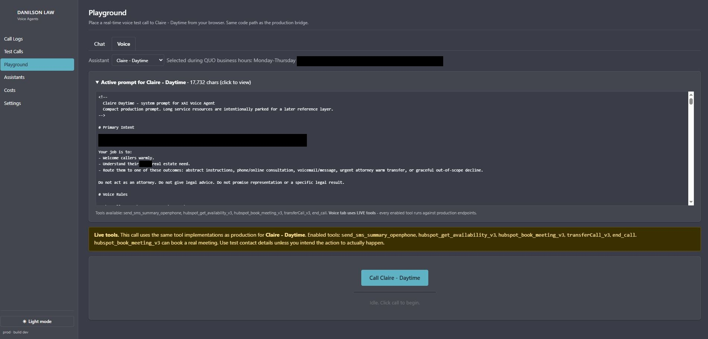
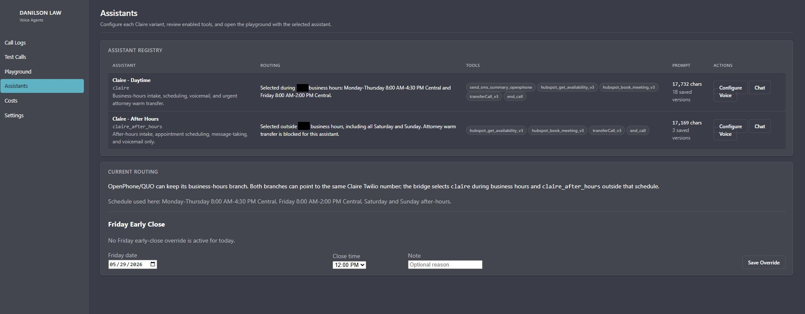
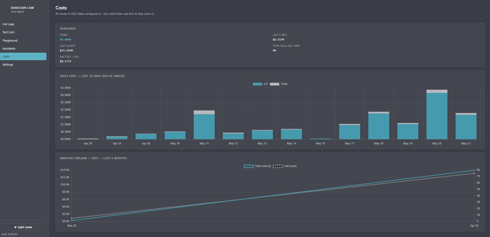
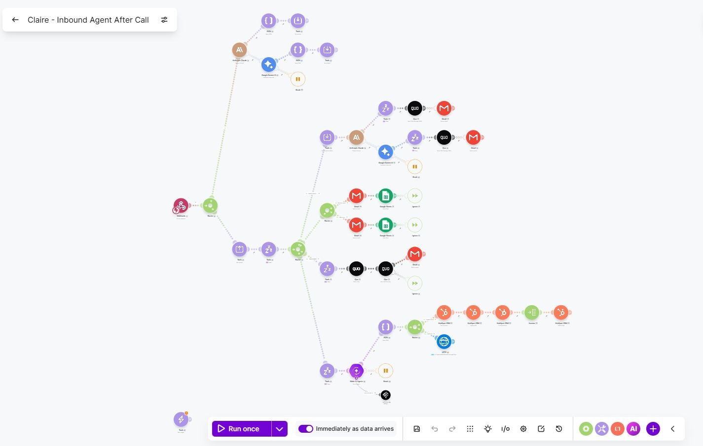

# Screenshots

Captures of the running app. All company-identifying info (caller names,
phone numbers, firm-specific copy) has been masked before upload.

The `db-*` shots are from the in-project **admin dashboard**
(FastAPI + Jinja2 + HTMX + Chart.js) — not a third-party platform. The
Make.com shot shows the after-call workflow that consumes the Vapi-shape
end-of-call envelope posted by [`notify_make.py`](../notify_make.py).

---

## 01 — Admin dashboard: Call logs

Per-call view of every session that hit the bridge. Each row is one
Twilio Media Stream session with: assistant, duration, outcome,
cost breakdown, recording playback link, and the structured-output
extraction (intent, requested action, summary) persisted from
[`post_call.py`](../post_call.py).

---

## 02 — Admin dashboard: In-browser voice playground

Mic capture → 48 kHz → 8 kHz μ-law `AudioWorklet` → the same
`/media-stream/{id}` WebSocket endpoint that Twilio talks to →
xAI Voice Agent API → playback. Lets you exercise the full audio
pipeline (barge-in, transcript demux, tool dispatch) without
spinning up Twilio + ngrok every change.

---

## 03 — Admin dashboard: Assistants tab

Static assistant registry from [`agents.py`](../agents.py) — name,
voice, model, business-hours schedule, and the system-prompt body
with HTMX-inline editing. Prompt edits write through to the
`prompts` table cached per-agent in [`db.py`](../db.py).

---

## 04 — Admin dashboard: Cost tracking

Per-assistant spend chart (Chart.js). Rolls up
audio-minute + text-token cost from the `tool_calls` and `calls`
tables. Cost accounting lives in [`post_call.py`](../post_call.py).

---

## 05 — Make.com: After-call workflow

Receives the Vapi-shape `end-of-call-report` envelope POSTed by
[`notify_make.py`](../notify_make.py) and fans it out to downstream
tools (CRM update, calendar booking confirmations, Google Chat
notification). Designed to drop straight into an existing Vapi setup —
the JSON shape matches Vapi's so the same scenario works with both.
